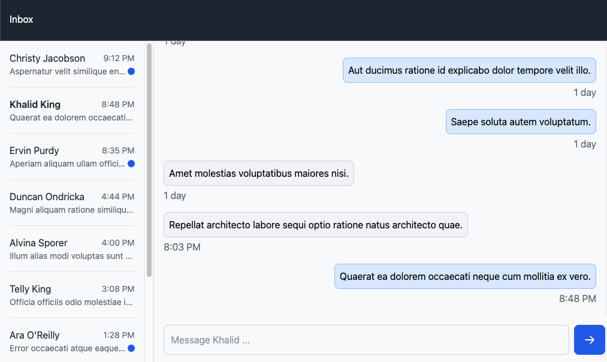

# Grayscale Inbox Interview

## Scenario

In this interview, you're provided with a partially completed frontend application. You'll pair program with a colleague to implement some missing features.

The goal is to engage in a problem-solving dialogue, not find a single right answer or complete every feature. In fact, there are probably more features than we'll have time to implement in this session -- and that's ok!

## Local setup

Requirements:

- `node`: >=16
- `yarn`

1. Install dependencies: `yarn install`
2. Start backend server: `yarn run gql:server` _or_ `PORT=8000 yarn run gql:server`
3. Start frontend server: `yarn run vite:dev` _or_ `API_BASE_URL=http://localhost:8000 yarn run vite:dev`

## The Application

You're building a chat application that allows a user to engage in two-way messaging with the application's other users. The two main sections of the application are:

1. A list of people, from which the user can select a person to chat with (this has already been implemented)
2. A message list correlating to the currently selected person, along with a form allowing the user to send a message to them (this is the part we'll implement)

### Backend

The backend for the application consists of a **GraphQL** API.

> [Schema definition](typeDefs.graphql)

> [GraphQL documentation](https://graphql.org/learn/)

The server provides the following fields:

| Operation    | Field             | Description                                                     |
| ------------ | ----------------- | --------------------------------------------------------------- |
| Query        | `people`          | Fetch a list of people                                          |
| Query        | `messages`        | Given a person, fetch messages between the user and that person |
| Mutation     | `sendMessage`     | Send a message to a person                                      |
| Mutation     | `markRead`        | Mark a conversation as read                                     |
| Subscription | `messageReceived` | Updated when a person sends a message to the user               |

### Frontend

#### Stack

The existing application is a **React** single-page application (SPA) written in **Typescript**.

Some dependencies are already installed for you to use:

- `@apollo/client` ([Documentation](https://www.apollographql.com/docs/react/))
- `date-fns` ([Documentation](https://date-fns.org/))
- `uuid` ([Documentation](https://www.npmjs.com/package/uuid/))

(Additionally, the `tailwindcss` ([Documentation](https://tailwindcss.com/docs/installation)) style library is already installed and in use -- however, you shouldn't need to write any new styles to complete the application.)

You are not required to use these dependencies if you prefer an alternative, and you may install additional dependencies if you wish (but your colleagues will probably ask you to justify their use)!

#### Architecture

The main React components of interest are:

- [`src/features/Messages/index.tsx`](src/features/Messages/index.tsx)
  - Renders the message list and new message form (this is what you'll be implementing)
- [`src/features/People/index.tsx`](src/features/People/index.tsx)
  - Renders the person list (already implemented)

GraphQL documents for use in querying the backend are provided:

- [`src/lib/queries.ts`](src/lib/queries.ts)
- [`src/lib/mutations.ts`](src/lib/mutations.ts)
- [`src/lib/subscriptions.ts`](src/lib/subscriptions.ts)

Additionally, there are some existing TypeScript types:

- [`src/lib/types.ts`](src/lib/types.ts)

## Tasks

The remaining feature requirements provided by the product team are:

### Message list

When a person is not selected:

- [ ] The user should see a Call To Action (CTA) in the Messages panel

When a person is selected, but there are no messages:

- [ ] The user should see a Call To Action (CTA) in the Messages panel

When a person is selected, and there are messages:

- [ ] The user should see a list of messages in the messages panel

### Sending messages

When a person is selected:

- [ ] The user should be able to enter & send a message

### Receiving messages

When a message is received:

- [ ] The user should see the message preview and timestamp in the person list, without refreshing

When a message is received, and the user is viewing the associated message list:

- [ ] The user should see the new message in the message list, without refreshing

### Unread messages

When a user has not yet viewed a received message from a person:

- [ ] An unread indicator should be displayed in the conversation list

> If at any time it's unclear what the exact requirements are to implement a feature, please feel free to
> clarify them with your colleague!
